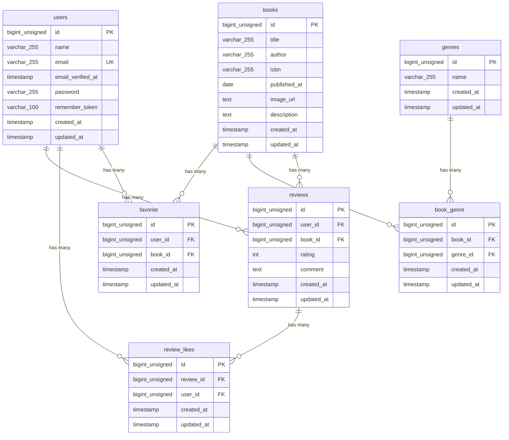

## プロジェクト名
    BookShelf 書籍レビューアプリ
## 概要
    本アプリは、本の検索やレビュー、お気に入り登録などができる書籍レビューアプリケーションです。
    ※なお、現在提供しているAPIエンドポイントは書籍一覧の取得、書籍詳細の取得、書籍の新規登録、書籍の更新、書籍を削除
    の操作のみとなります。

## ER図



## 環境構築手順

1. **リポジトリをクローン**

    ```bash
        git clone https://github.com/ryoga613/bookshelf_app 
    ```

2. **.envファイルの準備**

    `.env.example` をコピーして `.env` を作成します。

    ```bash
    cp .env.example .env
    ```

    `.env` ファイル内の以下のDB接続情報を確認・設定します。`.env.example` のデフォルト値はSail向けではないため、以下のように変更してください。

    ```ini
    DB_CONNECTION=mysql
    DB_HOST=mysql
    DB_PORT=3306
    DB_DATABASE=laravel
    DB_USERNAME=sail
    DB_PASSWORD=password
    ```

3. **Composer依存パッケージのインストール**

    プロジェクトの初回セットアップ時は、`vendor` ディレクトリが存在しないため `sail` コマンドを使用できません。
    以下のDockerコマンドを実行して、コンテナ内で `composer install` を実行します。

    ```bash
    docker run --rm \
        -u "$(id -u):$(id -g)" \
        -v "$(pwd):/var/www/html" \
        -w /var/www/html \
        laravelsail/php82-composer:latest \
        composer install --ignore-platform-reqs
    ```

4. **Laravel Sailの起動**

    以下のコマンドでDockerコンテナを起動します。

    ```bash
    ./vendor/bin/sail up -d
    ```

    > **エイリアスの設定（推奨）**
    >
    > 毎回 `./vendor/bin/sail` と入力するのは手間なので、エイリアスを設定すると便利です。
    >
    > ```bash
    > alias sail='[ -f sail ] && bash sail || bash vendor/bin/sail'
    > ```

5. **アプリケーションキーの生成**

    ```bash
    sail artisan key:generate
    ```

6. **データベースのマイグレーションと初期データ投入**

    以下のコマンドでテーブルを作成し、ダミーデータを投入します。

    ```bash
    sail artisan migrate:fresh --seed
    ```
    このコマンドの入力後、下記のエラーが表示されることがあります。
    ```bash
       Illuminate\Database\QueryException 
      SQLSTATE[HY000] [1044] Access denied for user 'sail'@'%' to database 'bookshelf-app' (Connection: mysql, SQL: select table_name as `name`,         (data_length + index_length) as `size`, table_comment as `comment`, engine as `engine`, table_collation as `collation` from information_schema.tables where table_schema = 'bookshelf-app' and table_type in ('BASE TABLE', 'SYSTEM VERSIONED') order by table_name)

      at vendor/laravel/framework/src/Illuminate/Database/Connection.php:829
        825▕                     $this->getName(), $query, $this->prepareBindings($bindings), $e
        826▕                 );
        827▕             }
        828▕ 
      ➜ 829▕             throw new QueryException(
        830▕                 $this->getName(), $query, $this->prepareBindings($bindings), $e
        831▕             );
        832▕         }
        833▕     }

      +43 vendor frames 

      44  artisan:35
          Illuminate\Foundation\Console\Kernel::handle()
    ```
    このエラーはコンテナ内にデータが残っており、エラーが生じているケースなどがあります。
    その場合は、以下のコマンドを順に実行して各コンテナを再起動して下さい。
    ```Bash
    sail down -v
    sail up -d　//コマンド実行後にSQLコンテナが立ち上がるまで時間がかかります。30秒ほどお待ちください。
    sail artisan migrate:fresh --seed
    ```
    

7. **フロントエンドのビルド**

    ```bash
    sail npm install
    sail npm install alpinejs
    sail npm run dev
    ```

    `npm run dev` は開発中は起動したままにしてください。

8. **アプリケーションへのアクセス**

    ブラウザで [http://localhost](http://localhost) にアクセスします。


## 使用技術

- PHP 8.2
- Laravel 10.x
- MySQL 8.0
- Nginx
- Docker / Docker Compose / Laravel Sail
- Vite / Tailwind CSS 3.4
- Laravel Fortify（認証）
- phpMyAdmin

## 作成者
上田　凌雅

## APIエンドポイント一覧

認証不要の公開APIです。全エンドポイントは `/api/v1` プレフィックス配下に定義されています。

| HTTPメソッド | URI | 概要 |
|---|---|---|
| GET | /api/v1/books | 書籍一覧を取得する |
| GET | /api/v1/books/{book} | 書籍詳細を取得する |
| POST | /api/v1/books | 書籍を新規登録する |
| PUT | /api/v1/books/{book} | 書籍を更新する |
| DELETE | /api/v1/books/{book} | 書籍を削除する |


## 開発環境URL

    ```bash
        http://localhost
    ```

